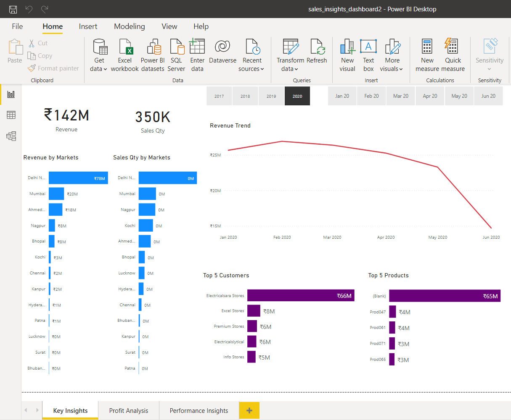
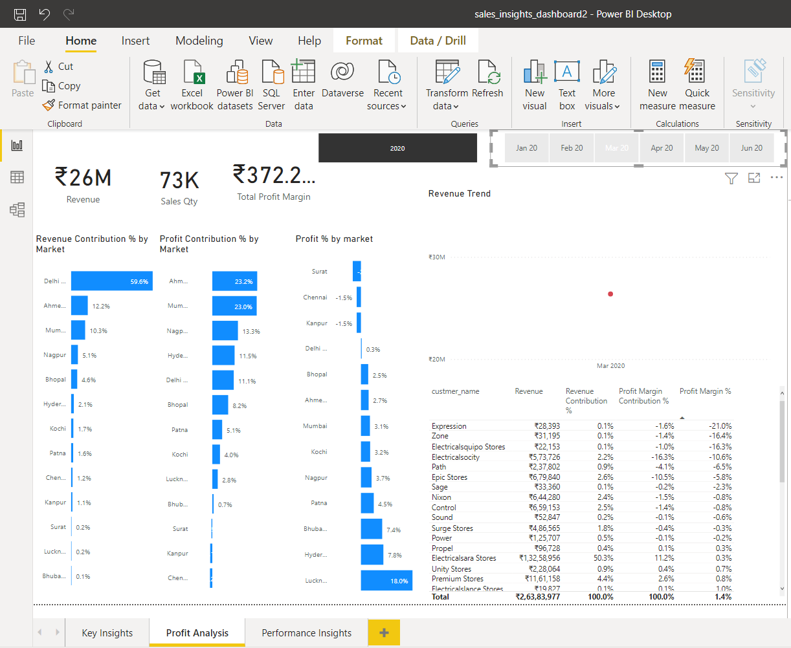
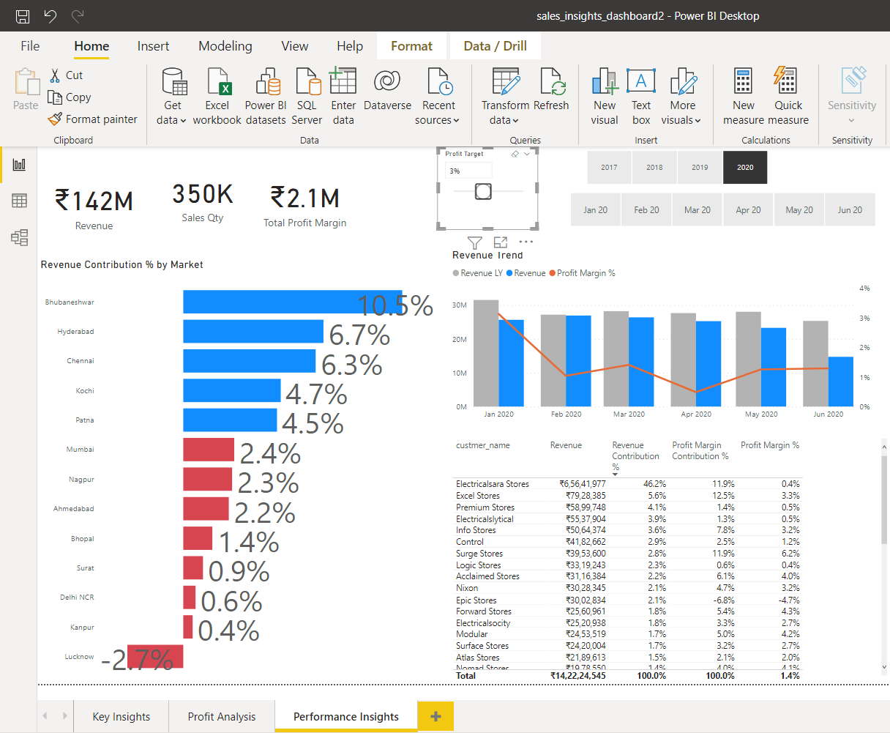

# Sales Insights Data Analysis Project using Tableau and PowerBI
## Screenshots

## Instructions to setup mysql on your local computer

1. Install mysql on your local computer
2. SQL database dump is in db_dump.sql file above. Download `db_dump.sql` file to your local computer and import it as per instructions.
============================
### Data Analysis Using SQL

1. Show all customer records
    `SELECT * FROM customers;`

2. Show total number of customers
    `SELECT count(*) FROM customers;`

3. Show transactions for Chennai market (market code for chennai is Mark001
    `SELECT * FROM transactions where market_code='Mark001';`

4. Show distrinct product codes that were sold in chennai
    `SELECT distinct product_code FROM transactions where market_code='Mark001';`

5. Show transactions where currency is US dollars
    `SELECT * from transactions where currency="USD"`

6. Show transactions in 2020 join by date table
    `SELECT transactions.*, date.* FROM transactions INNER JOIN date ON transactions.order_date=date.date where date.year=2020;`

7. Show total revenue in year 2020, January Month,
    `SELECT SUM(transactions.sales_amount) FROM transactions INNER JOIN date ON transactions.order_date=date.date where date.year=2020 and and date.month_name="January" and (transactions.currency="INR\r" or transactions.currency="USD\r");`

8. Show total revenue in year 2020 in Chennai
    `SELECT SUM(transactions.sales_amount) FROM transactions INNER JOIN date ON transactions.order_date=date.date where date.year=2020 and transactions.market_code="Mark001";`

9. Show total revenue in year 2020
    `SELECT SUM(transactions.sales_amount) FROM transactions INNER JOIN date ON transactions.order_date=date.date where date.year=2020 and transactions.currency="INR\r" or transactions.currency="USD\r";`

============================
## Data Analysis
1. Formula to create norm_amount column (Currency change)
`= Table.AddColumn(#"Filtered Rows", "norm_amount", each if [currency] = "USD" or [currency] ="USD#(cr)" then [sales_amount]*75 else [sales_amount], type any)`

============================
##### Kanak Agrawal 
##### 20196040
##### MNNIT ALLAHABAD (2K23 B.Tech)
##### akanak101@gmail.com

